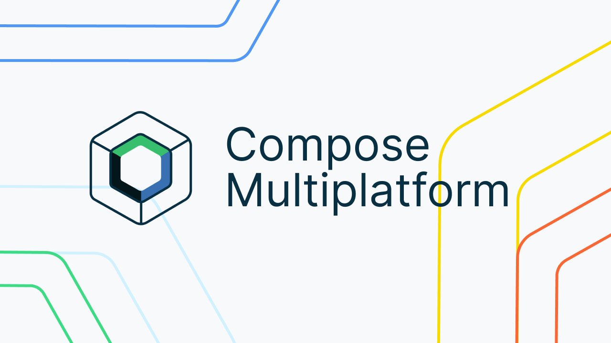

# The Compose Multiplatform Experiment

 
 

Hi there 👋

Welcome to this comprehensive experiment conducted using Compose Multiplatform, where we dive deep into performance metrics like FPS, Memory Usage, and App Size. The repository houses a total of 15 apps and 2 libraries, with 5 apps designed for Android and 10 for iOS. The core objective of this experiment is to gradually integrate KMP (Kotlin Multiplatform) and CMP (Compose Multiplatform) into these apps and compare their performance across various parameters.
 
 
To offer a detailed understanding, the methodology, the conducted experiments, and their respective results have been meticulously documented in a series of articles on Medium. These articles not only provide insights into the experimental process but also delve into the nuanced observations and learning outcomes. You can access the series through the following links:
 
 

- [Part 1: Introduction & Methodology](https://medium.com/@alitahasubfly/i-made-the-same-app-15-times-here-are-the-results-part-1-introduction-methodology-ae9fcc1485e4)
- [Part 2: Experiments & Results](https://medium.com/@alitahasubfly/i-made-the-same-app-15-times-here-are-the-results-part-2-experiments-results-27aeb93cb42b)
- [Part 3: Outcomes & Acknowledgements](https://medium.com/@alitahasubfly/i-made-the-same-app-15-times-here-are-the-results-part-3-outcomes-acknowledgements-d25a82f1c403)

 
This project is an open book for learning and sharing. Feel free to explore, share, and utilize any part of this article series and the project, while ensuring proper attribution. Your feedback is highly valued, and I am open to any questions or discussions that might arise from this work. For further queries, insights, or collaborations, feel free to connect with me at:
 
 

- LinkedIn: [Ali Taha Dincer](https://www.linkedin.com/in/ali-taha-dincer/)
- E-mail: [alitahasubfly@gmail.com](alitahasubfly@gmail.com)

 
Whether you're a seasoned developer or new to Kotlin and Compose Multiplatform, this repository serves as a valuable resource to understand the practical applications and performance implications of these technologies. Thank you for your interest, and I look forward to your engagement with this project!